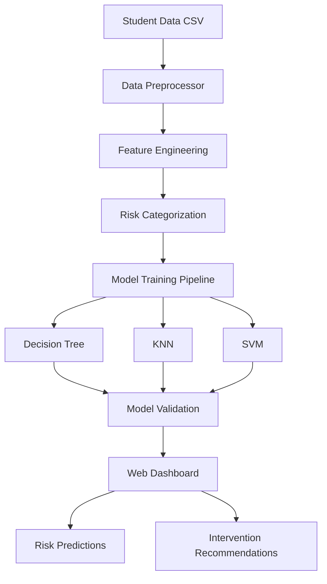

# 🎓 Student Performance Prediction System

A machine learning system that predicts student academic performance risk levels and provides actionable insights for educators. The system identifies students who may need additional support early in the academic term, enabling proactive intervention strategies.

## 🌟 Key Features

- **🤖 Multi-Model Prediction**: Uses Decision Trees, K-Nearest Neighbors, and Support Vector Machines
- **📊 Interactive Web Dashboard**: Real-time visualization of student risk levels
- **🔍 Model Interpretability**: SHAP-based explanations for prediction transparency
- **⚡ Batch Processing**: Analyze entire class rosters instantly
- **📈 Performance Validation**: Comprehensive model evaluation and comparison
- **🎯 Risk Categorization**: Classifies students into High, Medium, and Low risk categories

## 🚀 Getting Started

### Prerequisites

- Python 3.8 or higher
- pip package manager
- 4GB+ RAM recommended

### Installation

1. **Clone the repository:**
```bash
git clone <repository-url>
cd student-performance-prediction
```

2. **Install dependencies:**
```bash
pip install -r requirements.txt
```

3. **Verify installation:**
```bash
python3 -c "import sklearn, pandas, flask; print('All dependencies installed successfully!')"
```

### Quick Start

#### 1. Launch Web Application

```bash
# Start the web server
python3 run_web_app.py --port 8080

# Access the dashboard
# Open browser to: http://localhost:8080
```
#### 3. View Sample Predictions

The dashboard will automatically load with sample student data from `data/student-por.csv`, showing:
- Risk distribution across the class
- Individual student risk factors
- Model validation results

#### 2. Train Models (Optional - Pre-trained models included)

```bash
# Train all models with default settings
python3 examples/run_complete_pipeline.py

# Train specific models with custom parameters
python3 examples/test_models.py
```

## 🏗️ System Architecture

### Core Components

```
student-performance-prediction/
├── 📁 src/                     # Core application logic
│   ├── 📁 data/               # Data processing & preprocessing
│   ├── 📁 models/             # ML models & training pipeline
│   └── 📁 config/             # Configuration settings
├── 📁 web/                     # Flask web application
│   ├── 📁 templates/          # HTML templates
│   ├── 📁 static/             # CSS, JS, images
│   └── app.py                 # Main web application
├── 📁 data/                    # Raw datasets
├── 📁 models/trained/          # Saved model files
├── 📁 reports/                 # Analysis reports & visualizations
└── 📁 examples/               # Usage examples & scripts
```

### Data Flow Architecture



## 🧠 Machine Learning Pipeline

### 1. Data Preprocessing (`src/data/preprocessing.py`)

**Key Functions:**
- **Data Cleaning**: Handles missing values, outliers, and inconsistencies
- **Feature Engineering**: Creates meaningful features from raw student data
- **Categorical Encoding**: Converts categorical variables to numerical format
- **Feature Scaling**: Standardizes numerical features for optimal model performance

**Risk Categories:**
- **High Risk**: Students likely to score ≤ 9 (needs immediate intervention)
- **Medium Risk**: Students likely to score 10-14 (monitor closely)
- **Low Risk**: Students likely to score ≥ 15 (performing well)

### 2. Model Training (`src/models/train_model.py`)

**Training Process:**
1. **Data Split**: 70% training, 20% testing, 10% validation
2. **Hyperparameter Optimization**: GridSearchCV for best parameters
3. **Cross-Validation**: 5-fold stratified validation for robust evaluation
4. **Model Comparison**: Performance metrics across all models

**Available Models:**
- **Decision Tree**: Interpretable rules-based predictions
- **K-Nearest Neighbors**: Instance-based learning with similarity matching
- **Support Vector Machine**: High-dimensional classification with kernel methods

### 3. Model Interpretability (`src/models/model_interpreter.py`)

**SHAP Integration:**
- **Feature Importance**: Identifies which student characteristics most influence predictions
- **Individual Explanations**: Shows why specific students are classified as high-risk
- **Global Insights**: Reveals overall patterns in student performance factors

## 🌐 Web Application

### Dashboard Features (`web/app.py`)

**Class Overview:**
- **Student Metrics**: Total students, risk distribution, performance trends
- **Risk Analytics**: Interactive charts and detailed breakdowns
- **Student Profiles**: Individual risk factors and recommendations

**Key Routes:**
- `/` - Main dashboard with class overview
- `/predict` - Batch prediction interface (coming soon)
- `/validate` - Model performance validation

### Frontend Technologies

**Styling**: Modern CSS with Bootstrap 5 integration
**JavaScript**: Interactive charts with Plotly.js
**Responsive Design**: Mobile-friendly interface
**Icon Library**: Font Awesome for visual elements

## 📊 Model Performance

### Validation Metrics

**Current Model Accuracy:**
- Decision Tree: 85.0%
- K-Nearest Neighbors: 82.7%
- Support Vector Machine: 74.8%

**Evaluation Methods:**
- Cross-validation accuracy
- Precision, Recall, F1-score
- Confusion matrix analysis
- ROC curve analysis

## 💻 Usage Examples

### Programmatic Usage

```python
from src.models.model_factory import ModelFactory
from src.data.preprocessing import DataPreprocessor

# Load and preprocess data
preprocessor = DataPreprocessor()
X, y = preprocessor.preprocess_data('data/student-por.csv', ',')

# Create and train a model
model = ModelFactory.create_model('decision_tree')
model.train(X_train, y_train)

# Make predictions
predictions = model.predict(X_test)
risk_levels = ['Low', 'Medium', 'High']
```

### Batch Processing

```python
# Analyze entire class roster
python3 examples/analyze_student_performance.py --input class_data.csv
```

### Advanced Training Pipeline

```python
# Run complete training with interpretability
python3 examples/run_advanced_pipeline.py
```

## 📋 Data Format

### Input Requirements

**CSV Format:** Student data should include these key columns:
- **Academic**: G3 (final grade), failures, studytime
- **Social**: goout, Dalc, Walc (social activities, alcohol consumption)
- **Support**: schoolsup, famsup (school/family support)
- **Demographics**: age, sex, school
- **Family**: famrel, Medu, Fedu (family relationships, parent education)

**Sample Row:**
```csv
school,sex,age,studytime,failures,schoolsup,famsup,goout,Dalc,Walc,G3
GP,F,18,2,0,yes,no,4,1,1,6
```

### Output Format

**Risk Predictions:**
```json
{
  "student_id": "Student #1",
  "risk_level": "High",
  "confidence": 0.85,
  "factors": ["Past Failures", "Low Study Time", "High Social Activity"]
}
```

## 🔧 Configuration

### Model Parameters (`src/config/training_config.py`)

```python
CONFIG = {
    'test_size': 0.2,
    'random_state': 42,
    'models_to_train': ['decision_tree', 'knn', 'svm'],
    'optimize_hyperparameters': True,
    'cv_folds': 5
}
```

### Web Application Settings

```python
# run_web_app.py
python3 run_web_app.py --port 8080 --debug
```

## 📈 Advanced Features

### Model Interpretability

**SHAP Analysis:**
```bash
# Generate interpretability reports
python3 examples/run_advanced_pipeline.py --interpretability
```

**Feature Importance Visualization:**
- Global feature importance across all students
- Individual prediction explanations
- Counterfactual analysis ("What if" scenarios)

### Performance Monitoring

**Validation Dashboard:**
- Real-time model accuracy tracking
- Prediction vs. reality comparisons
- Model drift detection

### Extensibility

**Adding New Models:**
1. Create new model class inheriting from `BaseModel`
2. Implement required methods (`build_model`, `optimize_hyperparameters`)
3. Register in `ModelFactory`

**Custom Risk Categories:**
- Modify `create_risk_categories` in `DataPreprocessor`
- Adjust thresholds based on institutional needs

## 🤝 Contributing

### Development Setup

```bash
# Create development environment
python3 -m venv venv
source venv/bin/activate  # On Windows: venv\Scripts\activate
pip install -r requirements.txt
```

### Code Structure Guidelines

- **Models**: Extend `BaseModel` class
- **Data Processing**: Use `DataPreprocessor` pipeline
- **Web Routes**: Follow Flask best practices
- **Testing**: Add tests for new functionality

